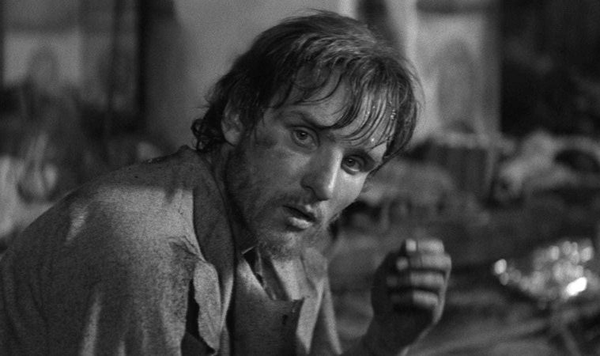

title: "Andrei Rublev: resonance, color, sound, and time"
date: 2017-08-27
tags: tarkovsky,film,silence,poetry
subject: andrei rublev
genre: film

It is hard to unpack a Tarkovsky film. You take any thread, start pulling and it turns out to be the entire tapestry. Which is not to say that his movies are simple. Rather that everything is linked. The length of the thread is time and time ducks into itself.

Watching a film you leave with moments ducked into each other: composite 

